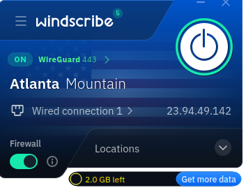
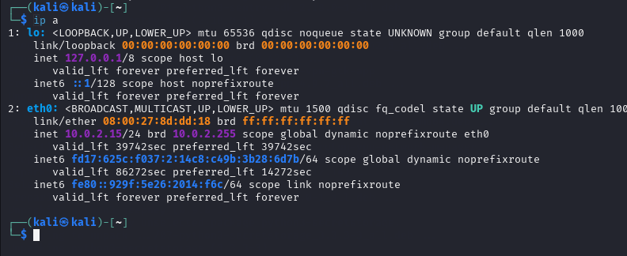
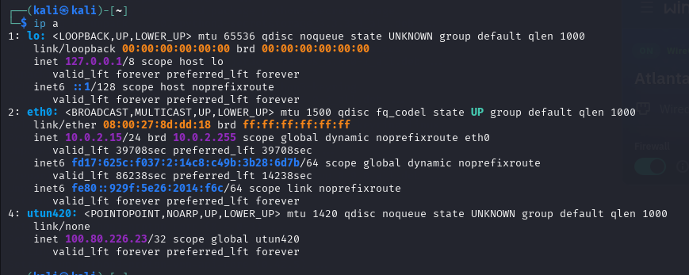
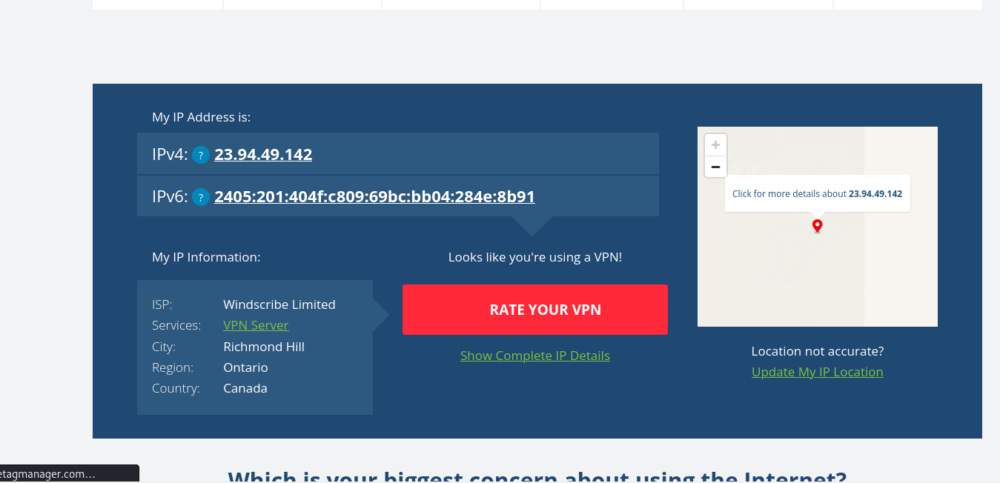

# Internship-Elevatelabs-task8

## Task 8 :

Identify and Remove Suspicious Browser Extensions

### Objective: 

Understand the role of VPNs in protecting privacy and secure communication.
### Tools:

Free VPN client (ProtonVPN free tier, Windscribe free)

### Deliverables:  

Report describing VPN setup steps and connection status screenshot

### Soltion:

Step 1 :- Windscribe free choosen as a reputable free VPN service and sign up is done. 

Step 2 :- Download and install the VPN client.

Step 3 :- Connect to a VPN server (choose any location).

 Step 4 :- Verify my IP address has changed

 ##### IP Address before VPN connection

##### IP Address after VPN connection

##### Use what is my IP address

 Step 5:- Research VPN encryption and privacy features.
 
 Step 6:- Write a summary on VPN benefits and limitations
